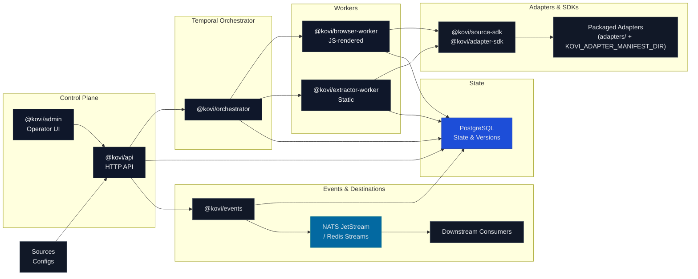

## Kovi Engine

Multi-tenant, selector-first web data extraction infrastructure for governed, authenticated, and replayable data workflows.

Kovi turns brittle scrapers into durable, policy-bound extraction pipelines backed by Temporal, PostgreSQL, and event streams.

---

### Stack

[](https://www.typescriptlang.org/)
[](https://pnpm.io/)
[](https://turbo.build/)
[](https://playwright.dev/)
[](https://temporal.io/)
[](https://www.postgresql.org/)
[](https://vitest.dev/)
[](LICENSE)

---

### What Kovi is

- Selector-first web data extraction, not ad-hoc scripts.
- Governed source execution with explicit policies and tenant boundaries.
- Authenticated sessions with safe storage and rotation.
- Durable workflows via Temporal (run, retry, replay).
- Downstream-ready change events for internal systems and destinations.

Kovi is **not** a CAPTCHA bypass, anti-bot evasion toolkit, or shady scraping repo.

---

### System diagram



---

### Capabilities

**Source Governance**
- Per-source policies: allowed domains, link patterns, depth, schedules.
- Explicit source definitions and contracts.
- Tenant-aware schema and service-token isolation.

**Extraction Engine**
- Static + JS-rendered extraction via dedicated workers.
- Selector-first adapters with strongly-typed contracts.
- Raw snapshots + normalized entities + versioned history.

**Runtime & Scheduling**
- Temporal workflows for run orchestration, retries, and backoff.
- Separate queues for static and browser workloads.
- Coordinated fan-out across many sources.

**Delivery & Replay**
- Destination registry and delivery records.
- Versioned event envelopes for downstream systems.
- Replay, backfill, and reprocess flows via API + workflows.

**Multi-Tenant Operations**
- Tenant-scoped data and policies.
- Admin/control plane for operators.
- Auditability and governance hooks.

---

### How it works

1. **Define a source** – base URL, selectors, allowed domains, schedules.
2. **Configure auth & policies** – cookies, header tokens, Playwright login; depth/rate/link policies.
3. **Crawl allowed entrypoints** – static or JS workers fetch permitted pages.
4. **Extract structured fields** – adapters apply selectors and emit entity records.
5. **Normalize & version** – canonical data stored with hashes and version history in PostgreSQL.
6. **Detect changes** – field-level diffs and change scopes computed per entity/page.
7. **Publish events** – change events sent via event bus and destination plugins.
8. **Replay/backfill** – operators trigger replays or backfills through the API and orchestrator.

---

### Monorepo map

```text
kovi-engine/
  apps/
    api/              -> @kovi/api         # HTTP runtime API service
    orchestrator/     -> @kovi/orchestrator # Temporal workflows/activities
    browser-worker/   -> @kovi/browser-worker # JS-rendered extraction worker
    extractor-worker/ -> @kovi/extractor-worker # static extraction + packaged adapters
    admin/            -> @kovi/admin       # operator/admin control plane

  packages/
    api/              -> @kovi/api-core    # reusable API/business logic and routes
    config/           -> @kovi/config      # configuration loading/validation
    contracts/        -> @kovi/contracts   # event/change contracts
    db/               -> @kovi/db          # PostgreSQL access & schema mapping
    events/           -> @kovi/events      # destination registry & delivery manager
    observability/    -> @kovi/observability # OpenTelemetry wiring
    shared/           -> @kovi/shared      # shared utilities & types
    source-sdk/       -> @kovi/source-sdk  # source adapter contracts & core helpers
    adapter-sdk/      -> @kovi/adapter-sdk # adapter authoring toolkit

  adapters/           # packaged adapters & manifests
  infra/              # docker-compose, migrations, temporal, monitoring
  docs/               # architecture, security, operations, contributing
```

Key distinctions:

- **`@kovi/api`** – runtime Fastify HTTP service.
- **`@kovi/api-core`** – reusable API/business-logic layer.
- **`@kovi/source-sdk`** – source adapter contracts and platform helpers.
- **`@kovi/adapter-sdk`** – SDK for adapter authors building on Kovi.

---

### Tech stack

- **TypeScript** – strict-typed services, SDKs, and contracts.
- **pnpm + Turborepo** – fast, consistent monorepo workflows.
- **Crawlee + Playwright** – static and JS-rendered extraction paths.
- **Temporal** – durable orchestration for runs, retries, and replay.
- **PostgreSQL** – storage for configs, runs, entities, versions, deliveries.
- **Redis Streams / NATS JetStream** – event backbones for change delivery.
- **OpenTelemetry** – tracing and metrics across API, workers, DB, and events.

---

### Getting started

```bash
git clone <repo-url>
cd kovi-engine

corepack enable
corepack use pnpm@9.12.0
pnpm install

cp .env.example .env
docker compose -f infra/docker-compose/docker-compose.yml up -d
```

Verify:

```bash
pnpm verify:env
pnpm verify:migrations
```

Full pre-PR validation:

```bash
pnpm check
# runs: verify:env, verify:migrations, lint, typecheck, test, build
```

Run services (separate terminals):

```bash
pnpm --filter @kovi/api dev
pnpm --filter @kovi/orchestrator dev
pnpm --filter @kovi/extractor-worker dev
pnpm --filter @kovi/browser-worker dev
pnpm --filter @kovi/admin dev
```

---

### Contributor flow

- Run `pnpm check` before each PR.
- Keep package boundaries clean (`@kovi/api-core` vs `@kovi/api`, `@kovi/source-sdk` vs `@kovi/adapter-sdk`, `@kovi/db`, `@kovi/events`).
- Add tests for changes to behavior.
- Preserve strict ESLint + TypeScript rules; do not relax them to “make it pass”.

See `CONTRIBUTING.md` and `docs/Contributor-Guide.md` for details.

---

### Safety & governance

Kovi is built for **permissioned access**, **governed source execution**, and **auditability**:

- No CAPTCHA solving, anti-bot evasion, or stealth modules.
- Authenticated access only via operator-provided credentials and session state.
- Crawls are policy-bound: allowed domains, internal link patterns, and depth are explicit.
- Tenant boundaries, service tokens, and audit logs are first-class concerns.

---

### Current status

- **In place**
  - Multi-tenant schema and governance hooks.
  - Static + JS-rendered workers.
  - Selector-first adapters and SDKs (`@kovi/source-sdk`, `@kovi/adapter-sdk`).
  - Temporal-based orchestration and retry semantics.
  - Raw + normalized + versioned storage and change-detection contracts.
  - Destination management and delivery records.
  - Admin/operator docs and strict CI (`lint`, `typecheck`, `test`, `build`, env/migration checks).

- **Still hardening**
  - Broader adapter catalog and destination plugins.
  - Additional E2E and contract/integration tests.
  - Operator UX refinements and scale/performance tuning.

---

### Roadmap (high level)

- **Foundation** – refine adapter contracts, worker orchestration, schema evolution.
- **Governance** – richer policy modeling, granular RBAC, expanded audit/cost reporting.
- **Operator Control Plane** – deeper health/diagnostic dashboards, onboarding/sandbox improvements.
- **Adapter Ecosystem** – more first-party adapters, templates, and authoring tooling.
- **Delivery Framework** – additional destination plugins and stronger downstream contracts.
- **Reliability Hardening** – failure-mode testing, chaos exercises, automated recovery playbooks.

---

### Docs index

- Architecture: `docs/Kovi-Architecture.md`
- Governance & security: `docs/Phase9-MultiTenant-Hardening.md`, `SECURITY_CHECKLIST.md`, `SECURITY_FINDINGS.md`
- Failure modes & operations: `FAILURE_MODES.md`, `docs/operations/Incident-Playbook.md`, `docs/operations/Source-Debugging-Guide.md`, `docs/operations/Session-Recovery-Guide.md`
- Quality & readiness: `RELEASE_READINESS.md`, `TEST_GAP_REPORT.md`, `PRIORITIZED_FIX_PLAN.md`, `FINAL_CHECK_RESULTS.md`
- Contributing: `CONTRIBUTING.md`, `docs/Contributor-Guide.md`, `docs/Testing-Matrix.md`

---

### Closing

Kovi Engine is infrastructure for **selector-first, governed, downstream-ready extraction workflows**. If you need repeatable, auditable web data pipelines with real operational controls, this repository is meant to be a serious foundation, not a throwaway scraper.
